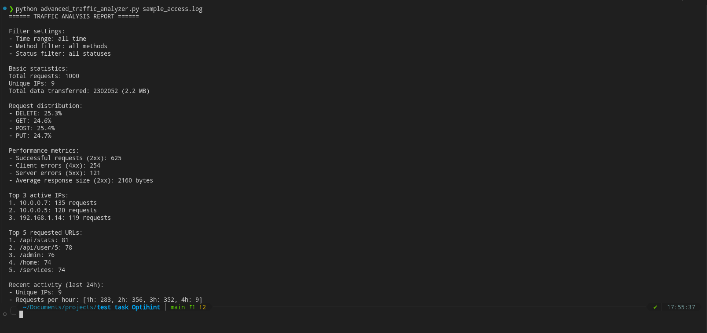
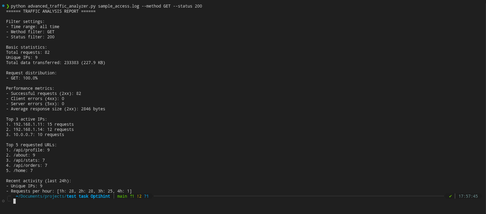
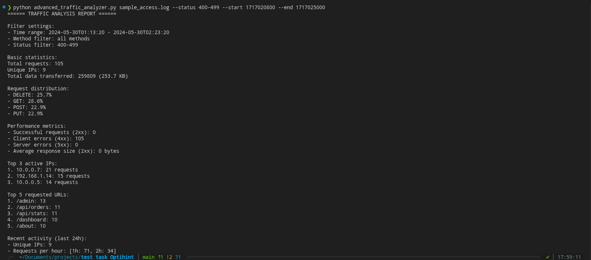
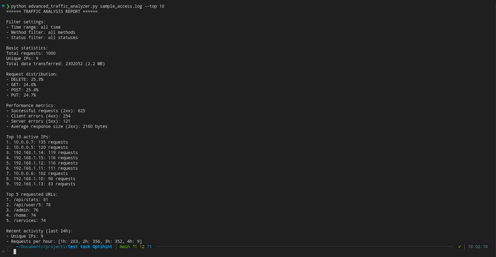

ТЗ на позицію Junior Backend Developer
Скрипт аналізує логи веб-сервера, підтримує фільтрацію, агрегацію даних та формує структурований звіт у консоль.

---

### Як працює?

Скрипт спочатку читає всі логи построчно, валідує їх, застосовує на них фільтри, 
потім рахує статистику і виводить звіт у консоль

Основні компоненти:

- `format_bytes()` - конвертує байти в читабельний формат
- `parse_arguments()` - парсить та валідує аргументи командної строки
- `LogRecord` - датакласс для лога з валідацією полів
- `LogParser` - читає файл та парсить записи, обробляє помилки
- `LogFilter` - фільтрує записи за method/status/time
- `TrafficAnalyzer` - рахує всю статистику та генерує звіт

Аргументи:

- `logfile` - шлях до файлу з логами (обов'язковий)
- `--method <METHOD>` - фільтр по http методу (GET, POST, PUT, DELETE, PATCH, HEAD, OPTIONS)
- `--status <CODE>` - фільтр по статус коду (200 або діапазон 400-499)
- `--start <TIMESTAMP>` - початок часового інтервалу (unix timestamp)
- `--end <TIMESTAMP>` - кінець часового інтервалу (unix timestamp)
- `--top <N>` - кількість ip в топі (за замовчуванням 3)

## Приклади запуску

Базовий запуск

python advanced_traffic_analyzer.py sample_access.log

---

Фільтр по методу та статусу:

python advanced_traffic_analyzer.py sample_access.log --method GET --status 200

---

Діапазон статусів та часу (працює з локальним часом):

python advanced_traffic_analyzer.py sample_access.log --status 400-499 --start 1717020800 --end 1717025000

---

Топ-10 активних ip:

python advanced_traffic_analyzer.py sample_access.log --top 10

---

## Алгоритмічна складність

- читання файлу: O(n)
- парсинг та валідація: O(n)
- фільтрація: O(n)
- агрегація (Counter, sum): O(n)
- генерація звіту: O(n)

---

## Можливі покращення

- обробка для великих файлів (зараз все в пам'яті)
- експорт результатів в json/csv
- графіки та візуалізація статистики
- підтримка різних форматів логів (nginx, apache)
- real-time моніторинг
- кешування результатів для повторних запитів